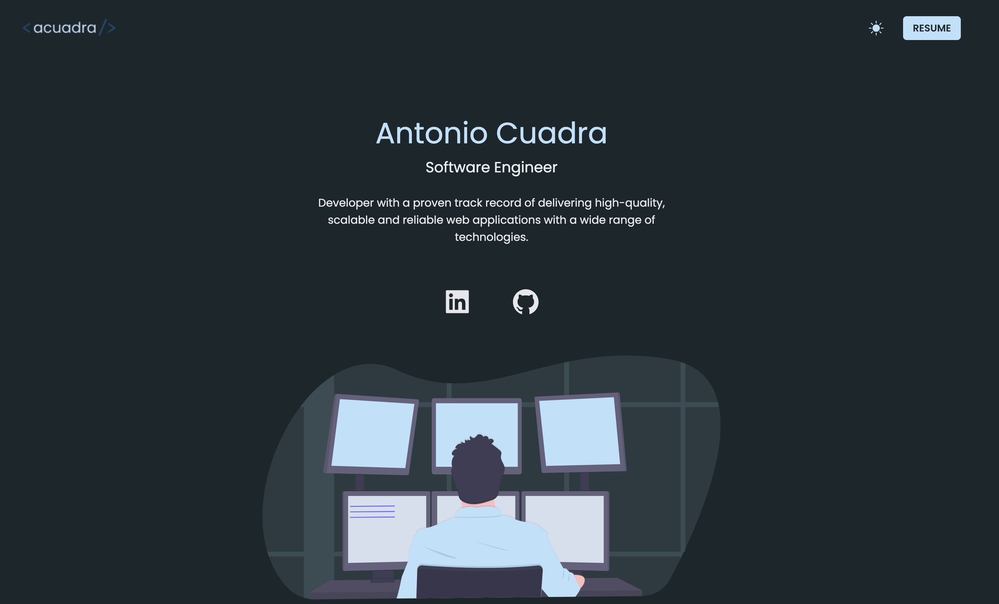

# Personal Portfolio - Antonio Cuadra

This repository contains the source code for my personal portfolio website, built with Next.js and Tailwind CSS. The site is designed to showcase my skills and projects as a full-stack developer, with a focus on a clean, modern, and high-contrast aesthetic.

**Live Site:** [**www.acuadraq.com**](https://www.acuadraq.com/)

## 💻 Tech Stack

This portfolio itself was built using a modern, performant tech stack:

* **Framework:** [Next.js](https://nextjs.org/) 
* **Language:** [TypeScript](https://www.typescriptlang.org/)
* **Styling:** [Tailwind CSS](https://tailwindcss.com/)
* **Animations:** [Framer Motion](https://www.framer.com/motion/)
* **Icons:** [React Icons](https://react-icons.github.io/react-icons/)
